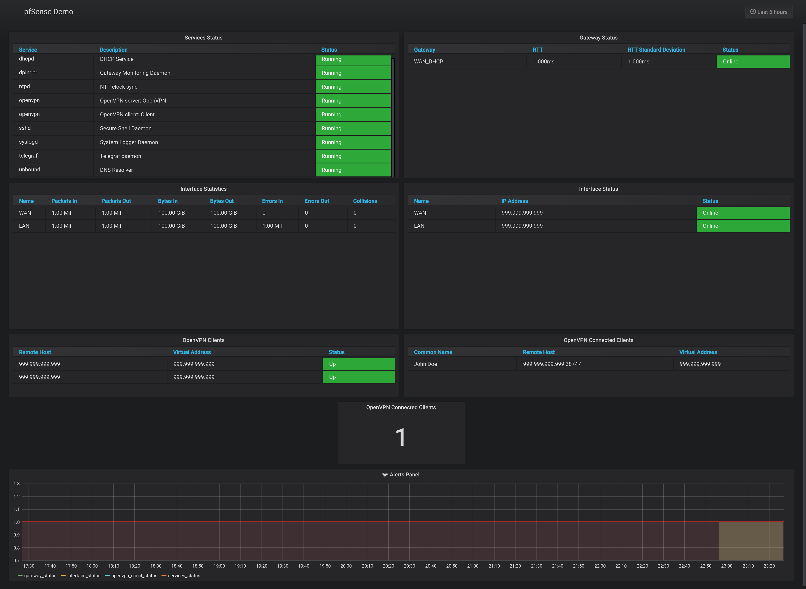

# pfSense-to-InfluxDB
This program is built to collect information from pfSense and send it to InfluxDB. The eventual goal in creating this program was to provide pfSense metrics and alerts to Grafana. The program uses FauxAPI to call the native PHP functions pfSense uses to create widgets on its dashboard.

Note: pfSense-to-InfluxDB is not intended to be installed on pfSense since pfSense doesn't ship with python3 installed. Installing on your InfluxDB host or another host is recommended.


## Installation
1. Install and configure [FauxAPI](https://github.com/ndejong/pfsense_fauxapi) on your pfSense router. Remember to add a new user to `/etc/fauxapi/credentials.ini` with permissions: `config_get, function_call`
  * Then add the following lines to `/etc/fauxapi/pfsense_function_calls.txt`:
  ```
  gwlb.inc:function return_gateways_status($byname = false)
  util.inc:function get_configured_interface_with_descr($only_opt = false, $with disabled = false)
  pfsense-utils.inc:function get_interface_info($ifdescr)
  openvpn.inc:function openvpn_get_active_clients()
  openvpn.inc:function openvpn_get_active_servers($type="multipoint")
  service-utils.inc:function get_services()
  service-utils.inc:function get_service_status($service)
  ```
2. Install latest release of pfSense-to-InfluxDB.
  * Using git:
  ```shell
  git clone https://github.com/ArmaanT/pfsense-to-influxdb.git --branch v1.1.0
  cd pfsense-to-influxdb
  ```
  * Or download directly:
  ```shell
  wget -O pfsense-to-influxdb.tar.gz "https://github.com/ArmaanT/pfsense-to-influxdb/archive/v1.1.0.tar.gz"
  tar -xf pfsense-to-influxdb.tar.gz
  mv pfsense-to-influxdb-* pfsense-to-influxdb
  rm pfsense-to-influxdb.tar.gz
  cd pfsense-to-influxdb
  ```
3. Install requirements:
  ```shell
  pip3 install -r requirements.txt
  ```

## Configuration
Rename `settings.sample.conf` to `settings.conf` and add your desired settings:

### General
| Key   | Description                                        |
| :---- | :------------------------------------------------- |
| Delay | Time (in seconds) between updates sent to InfluxDB |

### FauxAPI
| Key       | Description                                          |
| :-------- | :--------------------------------------------------- |
| APIHost   | IP Address or FQDN of pfSense Router                 |
| APIKey    | API Key created in `/etc/fauxapi/credentials.ini`    |
| APISecret | API Secret created in `/etc/fauxapi/credentials.ini` |

### InfluxDB
| Key          | Description                         |
| :----------- | :---------------------------------- |
| InfluxDBHost | IP Address or FQDN of InfluxDB Host |
| Port         | InfluxDB port. Normally 8086        |
| Username     | InfluxDB Username                   |
| Password     | InfluxDB Password                   |
| Database     | InfluxDB Database                   |

### Modules
| Key                       | Description                                                                          |
| :------------------------ | :----------------------------------------------------------------------------------- |
| Gateway_Status            | Enable metric gathering on gateway statuses (true/false)                             |
| Interface_Statistics      | Enable metric gathering on interface statistics (true/false)                         |
| Interface_Status          | Enable metric gathering on interface statuses (true/false)                           |
| OpenVPN_Client_Status     | Enable metric gathering on pfSense OpenVPN clients (true/false)                      |
| OpenVPN_Connected_Clients | Enable metric gathering on clients connected to pfSense OpenVPN servers (true/false) |
| Services_Status           | Enable metric gathering on service statuses (true/false)                             |

## Start at boot
A sample systemd service file, `pfsense_influx_collector.service`, is included to automatically run pfSense-to-InfluxDB on boot. Open the file to change the following lines to reflect your user and path to pfSenseInfluxCollector.py:
```shell
User=CHANGEME
ExecStart=/usr/bin/python3 /path/to/pfSenseInfluxCollector.py
```
Then install, enable, and start pfsense_influx_collector.service:
```shell
sudo cp pfsense_influx_collector.service /etc/systemd/system/pfsense_influx_collector.service
sudo systemctl enable pfsense_influx_collector.service
sudo systemctl start pfsense_influx_collector.service
```

## Grafana
A sample `pfsense_dashboard.json` is provided. First, add your pfsense InfluxDB database as a Grafana Data Source. Then to import the dashboard: hover over the create dashboard button (the plus sign) in Grafana, click "Import" and upload the dashboard.json file or paste the contents of the file in the text box and click "Load".

## Updating
* Using git:
```shell
cd /path/to/pfsense-to-influxdb
git pull origin v1.1.0
```
* Downloading directly
```shell
cd /tmp/
wget -O pfsense-to-influxdb.tar.gz "https://github.com/ArmaanT/pfsense-to-influxdb/archive/v1.1.0.tar.gz"
tar -xf pfsense-to-influxdb.tar.gz
mv pfsense-to-influxdb-*/* /path/to/previously-installed/pfsense-to-influxdb/
rm pfsense-to-influxdb.tar.gz
rm -r pfsense-to-influxdb-*
```

## InfluxDB Schema
### Measurement: gateway_status
| Field  | Description                                            |
| :----- | :----------------------------------------------------- |
| name   | Name of gateway                                        |
| rtt    | Round-trip time                                        |
| rttsd  | Standard deviation of RTT                              |
| status | Status of gateway (1 for online, 0 for other statuses) |

| Tag  | Description                  |
| :--- | :--------------------------- |
| host | pfSense hostname with domain |

### Measurement: interface_statistics
| Field       | Description           |
| :---------- | :-------------------- |
| bytes_in    | Number of bytes in    |
| bytes_out   | Number of bytes out   |
| collisions  | Number of collisions  |
| errors_in   | Number of errors in   |
| errors_out  | Number of errors out  |
| name        | Name of gateway       |
| packets_in  | Number of packets in  |
| packets_out | Number of packets out |

| Tag       | Description                  |
| :-------- | :--------------------------- |
| host      | pfSense hostname with domain |
| interface | Interface being polled       |

### Measurement: interface_status
| Field      | Description                                       |
| :--------- | :------------------------------------------------ |
| ip_address | IP address of interface                           |
| name       | Name of interface                                 |
| status     | Status of interface (1 for online, 0 for offline) |

| Tag       | Description                  |
| :-------- | :--------------------------- |
| host      | pfSense hostname with domain |
| interface | Interface being polled       |

### Measurement: openvpn_client_status
| Field           | Description                                            |
| :-------------- | :----------------------------------------------------- |
| remote_host     | Remote IP address of OpenVPN client                    |
| status          | Status of OpenVPN client (1 for online, 0 for offline) |
| virtual_address | Virtual IP address of OpenVPN client                   |

| Tag   | Description                  |
| :---- | :--------------------------- |
| host  | pfSense hostname with domain |
| vpnid | ID of OpenVPN Client         |

### Measurement: openvpn_connected_clients
| Field             | Description                 |
| :---------------- | :-------------------------- |
| client_id         | Client ID of connection     |
| common_name       | Name connected user         |
| connected_clients | Number of connected clients |
| remote_host       | Remote IP address of user   |
| virtual_address   | Virtual IP address of user  |

| Tag    | Description                                   |
| :----- | :-------------------------------------------- |
| host   | pfSense hostname with domain                  |
| server | pfSense OpenVPN Server client is connected to |

### Measurement: services_status
| Field       | Description                                     |
| :---------- | :---------------------------------------------- |
| description | Description of service                          |
| status      | Status of service (1 for online, 0 for offline) |

| Tag     | Description                  |
| :------ | :--------------------------- |
| host    | pfSense hostname with domain |
| service | Service being polled         |

## License
Licensed under the terms of the MIT license. See [LICENSE.md](https://github.com/ArmaanT/pfsense-to-influxdb/blob/master/LICENSE.md)
